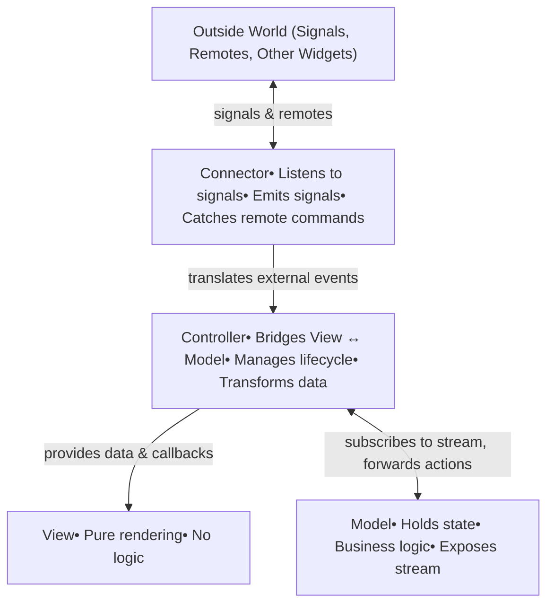

# TEA Architecture

## Overview

**TEA** is a unidirectional, modular, and scalable Flutter architecture designed to be **predictable** and **AI agent-friendly**. Communication topology is explicit and declared, not implicit.

> Verbosity in boilerplate is acceptable because AI writes it — what matters is clarity of structure for both AI agents and human reviewers.
> 

---

## Core Principles

1. **Unidirectional flow.** Data flows in one direction: Model → Controller → View. User actions flow back: View → Controller → Model.
2. **Explicit communication.** Every dependency and communication path must be declared. Nothing is implicit.
3. **Lower levels are completely unaware of upper levels.** A Model never references a Controller. A Controller never references a Connector.
4. **One outside boundary per widget.** The Connector is the only part that faces outward. View, Controller, and Model are invisible to the outside world.
5. **Self-documenting dependency graph.** SignalManager infers a dependency tree from declared signal subscriptions and remote usages.

---

## Layers

The architecture has exactly **two layers**:

| Layer | Contains |
| --- | --- |
| **Widget Layer** | Widgets and Managers (orchestrators) |
| **Repository Layer** | Data sources and platform service wrappers |
- **Widgets** — self-contained UI units following a strict four-part contract.
- **Managers** — top-level coordinator widgets. Structurally identical to regular widgets; they simply sit higher in the dependency tree and orchestrate other widgets.
- **Repositories** — house data sources and platform capabilities. Internal organization is to be defined.

---

## Widget Anatomy

Every widget consists of **exactly four parts**, each with a single responsibility:

| Part | Role | Knows About | Doesn't Know About |
| --- | --- | --- | --- |
| **View** | Pure rendering | Data it receives, callbacks it's given | Model, Connector, outside world |
| **Controller** | Internal coordinator (View ↔ Model) | View, Model | Connector, Signals, Remotes |
| **Connector** | Single outside boundary | Controller, SignalManager, RemoteManager | View, Model internals |
| **Model** | State holder & business logic | Its own state and logic | Everything else |



Each widget lives in its own folder with four files:

```
features/
  my_widget/
    my_widget_view.dart        # View
    my_widget_controller.dart  # Controller
    my_widget_connector.dart   # Connector
    my_widget_model.dart       # Model
```

---

### View

> The rendering layer. Pure UI, no logic.
> 

The View builds the widget tree using Flutter primitives. It receives all data and callbacks from the Controller — no direct state access, no business logic.

The boundary with Controller is intentionally blurry. Flutter doesn't separate markup from code the way web frameworks do. Rather than fighting this, TEA accepts it.

```dart
// my_widget_view.dart
class MyWidgetView extends StatelessWidget {
  final String title;
  final bool isLoading;
  final VoidCallback onSave;

  const MyWidgetView({
    super.key,
    required this.title,
    required this.isLoading,
    required this.onSave,
  });

  @override
  Widget build(BuildContext context) {
    return Column(
      children: [
        if (isLoading)
          const CircularProgressIndicator()
        else
          Text(title),
        ElevatedButton(
          onPressed: onSave,
          child: const Text('Save'),
        ),
      ],
    );
  }
}
```

---

### Controller

> The internal coordinator. Bridges View and Model.
> 

The Controller subscribes to the Model's state stream, transforms data for the View, forwards user actions to the Model, and manages the Flutter lifecycle (`initState`, `dispose`, animation controllers, focus nodes).

**Rules:**

- Never emits or listens to signals. Never touches RemoteManager. That's the Connector's job.
- Subscribes to `Model.stream` — calls `setState` on emission to drive View rebuilds.
- Can transform data (e.g. format a `DateTime` into a display string).

```dart
// my_widget_controller.dart
class MyWidget extends StatefulWidget {
  const MyWidget({super.key});
  @override
  State<MyWidget> createState() => _MyWidgetController();
}

class _MyWidgetController extends State<MyWidget> {
  late final MyWidgetModel _model;
  late final StreamSubscription<MyWidgetState> _subscription;

  @override
  void initState() {
    super.initState();
    _model = MyWidgetModel();
    _subscription = _model.stream.listen((_) {
      setState(() {});
    });
  }

  void _onSave() {
    _model.save();
  }

  @override
  void dispose() {
    _subscription.cancel();
    _model.dispose();
    super.dispose();
  }

  @override
  Widget build(BuildContext context) {
    final state = _model.state;
    return MyWidgetView(
      title: state.title,
      isLoading: state.isLoading,
      onSave: _onSave,
    );
  }
}
```

---

### Connector

> The single outside boundary. The only part the outside world talks to.
> 

The Connector is what makes TEA's communication model explicit. If something outside wants to affect this widget, it goes through the Connector. If this widget wants to tell the outside world something, it goes through the Connector.

**Rules:**

- Instantiated and managed by the Controller (initialized in `initState`, disposed in `dispose`).
- Listens to Signals via `SignalManager.listen<T>()`.
- Emits Signals via `SignalManager.emit()`.
- Registers for Remote commands via `RemoteManager.register<T>()`.
- Nothing else faces outward — View, Controller, and Model are invisible to the outside.

```dart
// my_widget_connector.dart
class MyWidgetConnector {
  final SignalManager _signalManager;
  final RemoteManager _remoteManager;
  final void Function() onExternalReset;
  final void Function() onScrollToTop;

  MyWidgetConnector({
    required SignalManager signalManager,
    required RemoteManager remoteManager,
    required this.onExternalReset,
    required this.onScrollToTop,
  })  : _signalManager = signalManager,
        _remoteManager = remoteManager;

  void init() {
    _signalManager.listen<UserLoggedOutSignal>(this, (signal) {
      onExternalReset();
    });

    _remoteManager.register<MyWidgetRemote>(
      MyWidgetRemote(scrollToTop: onScrollToTop),
    );
  }

  void emitSaved(String title) {
    _signalManager.emit(MyWidgetSavedSignal(title: title));
  }

  void dispose() {
    _signalManager.unlistenAll(this);
    _remoteManager.unregister<MyWidgetRemote>();
  }
}
```

---

### Model

> State holder and business logic. Knows nothing about the widget above it.
> 

The Model is where state and business logic live. BLoC-inspired but doesn't mandate `flutter_bloc`. A simple `StreamController` with an immutable state class works.

**Rules:**

- Zero Flutter dependencies — pure Dart only.
- State is an immutable value class with a named `initial()` factory constructor.
- Exposes a `Stream` via a broadcast `StreamController`.
- After mutating state, always call `_controller.add(_state)`.
- Could be unit tested with zero Flutter dependencies.

```dart
// my_widget_model.dart
class MyWidgetState {
  final String title;
  final bool isLoading;

  const MyWidgetState({
    required this.title,
    required this.isLoading,
  });

  factory MyWidgetState.initial() =>
      const MyWidgetState(title: '', isLoading: false);

  MyWidgetState copyWith({String? title, bool? isLoading}) {
    return MyWidgetState(
      title: title ?? this.title,
      isLoading: isLoading ?? this.isLoading,
    );
  }
}

class MyWidgetModel {
  final _streamController =
      StreamController<MyWidgetState>.broadcast();

  Stream<MyWidgetState> get stream => _streamController.stream;

  MyWidgetState _state = MyWidgetState.initial();
  MyWidgetState get state => _state;

  void save() {
    if (_state.title.isEmpty) return;
    _state = _state.copyWith(isLoading: true);
    _streamController.add(_state);
    // ... async operation, then:
    _state = _state.copyWith(isLoading: false);
    _streamController.add(_state);
  }

  void reset() {
    _state = MyWidgetState.initial();
    _streamController.add(_state);
  }

  void dispose() {
    _streamController.close();
  }
}
```

---

## Communication

Two mechanisms exist: **Signals** and **Remotes**.

### Signals

Signals are the universal communication mechanism. Any node — widget, manager, or repository — can emit and listen to them.

- Signals are **typed Dart classes**, one class per signal, named `<Context>Signal`.
- All signals live in `lib/signals/`.
- Signal propagation follows the dependency tree; higher levels can stop propagation.
- Signals carry data as **immutable fields**.
- **Never use signals for return values.** If you need a response, emit a separate signal.

```dart
// lib/signals/my_widget_signals.dart
class MyWidgetSavedSignal {
  final String title;
  const MyWidgetSavedSignal({required this.title});
}
```

### Remotes

Remotes provide one-way UI control — thin interfaces over `RemoteManager`, identified by widget ID.

- Remotes are **typed interfaces**, named `<Widget>Remote`. All remotes live in `lib/remotes/`.
- **One-way only.** No return values. No futures. Fire and forget.
- If you need feedback from a remote action, listen to a signal instead.
- **Broadcast by default** — all live instances of the widget respond. Use a key only for precision targeting.
- If no instance is alive, remote calls are **silently ignored**.
- Every remote-controllable widget registers with `RemoteManager` automatically on construction.

```dart
// lib/remotes/my_widget_remote.dart
class MyWidgetRemote {
  final void Function() scrollToTop;
  const MyWidgetRemote({required this.scrollToTop});
}
```

---

## Dependency Tree

`SignalManager` infers a dependency tree from declared signal subscriptions and remote usages. If you listen to a widget's signal or control it via remote, you are **above** it in the tree. This makes the architecture self-documenting.

---

## Naming Conventions

| Element | Convention | Example |
| --- | --- | --- |
| Widget folder | `snake_case` | `chat_message/` |
| View file | `<name>_view.dart` | `chat_message_view.dart` |
| Controller file | `<name>_controller.dart` | `chat_message_controller.dart` |
| Connector file | `<name>_connector.dart` | `chat_message_connector.dart` |
| Model file | `<name>_model.dart` | `chat_message_model.dart` |
| State class | `<Name>State` | `ChatMessageState` |
| Model class | `<Name>Model` | `ChatMessageModel` |
| Signal class | `<Context>Signal` | `MessageReceivedSignal` |
| Remote class | `<Name>Remote` | `ChatListRemote` |
| Manager widget | `<Name>Manager` | `ChatManager` |

---

## Complete Example: Counter Widget

A minimal but complete TEA widget:

```dart
// counter_model.dart
import 'dart:async';

class CounterState {
  final int count;
  const CounterState({required this.count});
  factory CounterState.initial() => const CounterState(count: 0);
  CounterState copyWith({int? count}) =>
      CounterState(count: count ?? this.count);
}

class CounterModel {
  final _sc = StreamController<CounterState>.broadcast();
  Stream<CounterState> get stream => _sc.stream;
  CounterState _state = CounterState.initial();
  CounterState get state => _state;

  void increment() {
    _state = _state.copyWith(count: _state.count + 1);
    _sc.add(_state);
  }

  void dispose() => _sc.close();
}
```

```dart
// counter_view.dart
import 'package:flutter/material.dart';

class CounterView extends StatelessWidget {
  final int count;
  final VoidCallback onIncrement;
  const CounterView({
    super.key,
    required this.count,
    required this.onIncrement,
  });

  @override
  Widget build(BuildContext context) {
    return Column(children: [
      Text('$count'),
      IconButton(
        icon: const Icon(Icons.add),
        onPressed: onIncrement,
      ),
    ]);
  }
}
```

```dart
// counter_controller.dart
import 'dart:async';
import 'package:flutter/material.dart';

class Counter extends StatefulWidget {
  const Counter({super.key});
  @override
  State<Counter> createState() => _CounterController();
}

class _CounterController extends State<Counter> {
  late final CounterModel _model;
  late final CounterConnector _connector;
  late final StreamSubscription<CounterState> _sub;

  @override
  void initState() {
    super.initState();
    _model = CounterModel();
    _connector = CounterConnector()..init();
    _sub = _model.stream.listen((_) => setState(() {}));
  }

  @override
  void dispose() {
    _connector.dispose();
    _sub.cancel();
    _model.dispose();
    super.dispose();
  }

  @override
  Widget build(BuildContext context) =>
      CounterView(count: _model.state.count, onIncrement: _model.increment);
}
```

```dart
// counter_connector.dart (minimal — no signals or remotes needed)
class CounterConnector {
  void init() {}
  void dispose() {}
}
```

---

## Checklist: Implementing a New Widget

1. Create the widget folder under `lib/features/<widget_name>/`
2. Create `<name>_model.dart` — define the immutable state class and model class
3. Create `<name>_view.dart` — pure rendering, all data as constructor params
4. Create `<name>_controller.dart` — subscribe to model stream, forward actions, manage lifecycle
5. Create `<name>_connector.dart` — declare all signal subscriptions and remote registrations
6. Wire Connector into Controller's `initState` and `dispose`
7. Define any new signals in `lib/signals/`
8. Define any new remotes in `lib/remotes/`

**Verification:**

- Model has zero Flutter imports
- Controller has zero SignalManager/RemoteManager references
- Nothing outside the widget references View, Controller, or Model directly

---

## Common Mistakes

| ❌ Wrong | ✅ Correct |
| --- | --- |
| Controller emits a signal | Connector emits the signal |
| View reads from Model directly | View receives data as constructor params from Controller |
| Model imports `package:flutter` | Model is pure Dart only |
| Two widgets talk to each other directly | They communicate via Signals or Remotes through Connectors |
| Manager holds business logic | Business logic lives in Model |
| Signal carries mutable objects | Signal fields are immutable |
| Remote returns a value | Remote is void; use a signal for feedback |
| Widget disposes without unregistering | Always call `connector.dispose()` in Controller's `dispose()` |

---

## Open Questions

This architecture is a work in progress. Known areas that need further design:

- **Circular dependency detection** — does SignalManager catch them or do they silently cause bugs?
- **Signal ordering** — if multiple nodes listen to the same signal, is execution order guaranteed?
- **BLoC integration** — intended but specifics are undefined.
- **Repository layer internals** — internal organization of data sources and platform services.
- **Testing strategy** — how to mock SignalManager/RemoteManager and test widgets in isolation.
- **Lifecycle management** — are signal subscription cleanups automatic or manual?
- **Developer onboarding** — step-by-step guide for starting a new feature.

---

## Status

🚧 **Work in progress** — the core concepts and widget contract are defined. Signal/Remote infrastructure, repository layer design, and testing patterns are actively being developed.

---

## License

MIT
